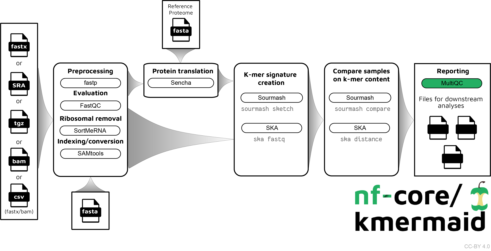

# 

**Compare DNA/RNA/protein sequences on k-mer content**.

[](https://github.com/nf-core/kmermaid/actions)
[](https://github.com/nf-core/kmermaid/actions)
[](https://www.nextflow.io/)

[](https://bioconda.github.io/)
[](https://hub.docker.com/r/nfcore/kmermaid)
[](https://zenodo.org/badge/latestdoi/197811232)
[](https://nfcore.slack.com/channels/kmermaid)

## Introduction



The pipeline is built using [Nextflow](https://www.nextflow.io), a workflow tool to run tasks across multiple compute infrastructures in a very portable manner. It comes with docker containers making installation trivial and results highly reproducible.

## Quick Start

i. Install [`nextflow`](https://nf-co.re/usage/installation)

ii. Install either [`Docker`](https://docs.docker.com/engine/installation/) or [`Singularity`](https://www.sylabs.io/guides/3.0/user-guide/) for full pipeline reproducibility (please only use [`Conda`](https://conda.io/miniconda.html) as a last resort; see [docs](https://nf-co.re/usage/configuration#basic-configuration-profiles))

iii. Download the pipeline and test it on a minimal dataset with a single command

```bash
nextflow run nf-core/kmermaid -profile test,<docker/singularity/conda/institute>
```

> Please check [nf-core/configs](https://github.com/nf-core/configs#documentation) to see if a custom config file to run nf-core pipelines already exists for your Institute. If so, you can simply use `-profile <institute>` in your command. This will enable either `docker` or `singularity` and set the appropriate execution settings for your local compute environment.

iv. Start running your own analysis!

```bash
nextflow run nf-core/kmermaid -profile <docker/singularity/conda/institute> --input '*_R{1,2}.fastq.gz' --genome GRCh37
```

See [usage docs](docs/usage.md) for all of the available options when running the pipeline.

## Documentation

The nf-core/kmermaid pipeline comes with documentation about the pipeline, found in the `docs/` directory:

1. [Installation](https://nf-co.re/usage/installation)
2. Pipeline configuration
    * [Local installation](https://nf-co.re/usage/local_installation)
    * [Adding your own system config](https://nf-co.re/usage/adding_own_config)
    * [Reference genomes](https://nf-co.re/usage/reference_genomes)
3. [Running the pipeline](docs/usage.md)
4. [Output and how to interpret the results](docs/output.md)
5. [Troubleshooting](https://nf-co.re/usage/troubleshooting)

## Usage

### With a samples.csv file

```bash
nextflow run nf-core/kmermaid --outdir s3://bucket/sub-bucket --samples samples.csv
```

### With R1, R2 read pairs

```bash
nextflow run nf-core/kmermaid --outdir s3://olgabot-maca/nf-kmer-similarity/ \
  --read_pairs 's3://bucket/sub-bucket/*{R1,R2}*.fastq.gz,s3://bucket/sub-bucket2/*{1,2}.fastq.gz'
```

### With SRA ids

```bash
nextflow run nf-core/kmermaid --outdir s3://bucket/sub-bucket --sra SRP016501
```

### With fasta files

```bash
nextflow run nf-core/kmermaid --outdir s3://bucket/sub-bucket \
  --fastas '*.fasta'
```

### With bam file

```bash
nextflow run nf-core/kmermaid  --outdir s3://bucket/sub-bucket \
  --bam 'possorted_genome_bam.bam'
```

### With split kmer

```bash
nextflow run nf-core/kmermaid --outdir s3://bucket/sub-bucket --samples samples.csv --split_kmer --subsample 1000
```

## Credits

nf-core/kmermaid was originally written by Olga Botvinnik.

## Contributions and Support

If you would like to contribute to this pipeline, please see the [contributing guidelines](.github/CONTRIBUTING.md).

For further information or help, don't hesitate to get in touch on [Slack](https://nfcore.slack.com/channels/kmermaid) (you can join with [this invite](https://nf-co.re/join/slack)).

## Citation

If you use  nf-core/kmermaid for your analysis, please cite it using the following doi: [10.5281/zenodo.4143940](https://zenodo.org/record/4143940)

You can cite the `nf-core` publication as follows:

> **The nf-core framework for community-curated bioinformatics pipelines.**
>
> Philip Ewels, Alexander Peltzer, Sven Fillinger, Harshil Patel, Johannes Alneberg, Andreas Wilm, Maxime Ulysse Garcia, Paolo Di Tommaso & Sven Nahnsen.
>
> _Nat Biotechnol._ 2020 Feb 13. doi: [10.1038/s41587-020-0439-x](https://dx.doi.org/10.1038/s41587-020-0439-x).  
> ReadCube: [Full Access Link](https://rdcu.be/b1GjZ)
